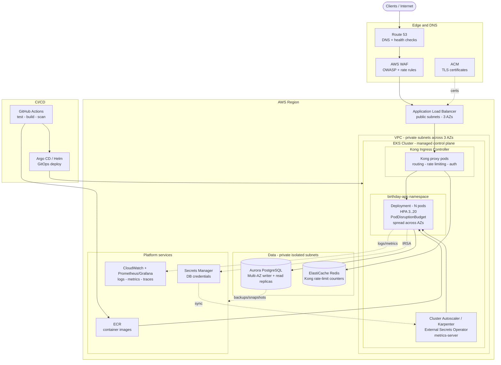

# Part 3 — Production Deployment on AWS

The service is treated as **high-criticality, high-usage**. The target is a
resilient, multi-AZ deployment on **EKS**, with the same artifacts used locally
(the container image and the Helm chart) promoted unchanged to production.

> The diagram below is Mermaid and renders directly on GitHub/GitLab. A
> standalone source lives in [`diagram.mmd`](diagram.mmd).

## System diagram

## How I would make this happen

Everything below is provisioned as **Terraform** (VPC, EKS, Aurora, IAM, ECR,
Route 53, ACM, WAF) plus **Helm/Argo CD** for in-cluster workloads. Infra and
app config live in Git; nothing is clicked in the console.

### 1. Networking (VPC)
- A VPC spanning **3 Availability Zones**. Three subnet tiers:
  **public** (ALB, NAT gateways), **private** (EKS worker nodes / pods),
  **isolated** (Aurora, ElastiCache — no route to the internet).
- One **NAT gateway per AZ** for egress (image pulls, AWS APIs) with no AZ
  becoming a single point of failure.
- VPC endpoints for ECR, S3, Secrets Manager and CloudWatch to keep traffic on
  the AWS backbone and cut NAT cost.

### 2. Edge & security
- **Route 53** hosts the domain with health-checked records; latency/failover
  routing enables multi-region later.
- **ACM** issues/renews the TLS certificate terminated at the ALB.
- **AWS WAF** in front of the ALB: managed OWASP rule sets, IP reputation and a
  coarse rate rule (defense in depth on top of Kong's fine-grained limiting).
- **ALB** (public) forwards HTTPS to the Kong proxy Service inside EKS
  (via the AWS Load Balancer Controller / a `LoadBalancer` Service).

### 3. Compute (EKS)
- **EKS** with a managed control plane (multi-AZ by design).
- Worker capacity via **managed node groups or Karpenter**, across all 3 AZs,
  mixing on-demand (baseline) and spot (burst) for cost.
- The **same Helm chart** as local, with production overrides (a prod values
  file or `--set`): `postgresql.enabled=false`, `database.existingSecret`, higher
  replica counts, and Redis-backed rate limiting. Adding a `PodDisruptionBudget`
  and zone spreading (`topologySpreadConstraints`) is where I'd harden it further.
- **Kong Ingress Controller** runs in-cluster as the L7 gateway: routing, rate
  limiting, and a drop-in point for auth (API keys / JWT / OIDC), request
  transformation and observability plugins.

### 4. Data
- **Amazon Aurora PostgreSQL**, Multi-AZ: a writer plus **read replicas** in
  other AZs; automatic failover. Application connects via the **cluster writer
  endpoint**; the schema is identical to local.
- **ElastiCache (Redis)** holds Kong's rate-limit counters so limits are
  enforced consistently across all Kong replicas (the `redis` rate-limiting
  policy, set via a production values override).
- Automated backups + snapshots; Point-in-Time Recovery enabled.

### 5. Secrets & identity
- DB credentials live in **AWS Secrets Manager**. The **External Secrets
  Operator** syncs them into a Kubernetes Secret that the chart consumes via
  `database.existingSecret` — **no credential is ever committed to Git**.
- Pods assume a fine-grained IAM role through **IRSA** (IAM Roles for Service
  Accounts) — the chart's `ServiceAccount` is the anchor for this.

### 6. Scaling & resilience (the "high usage / high criticality" part)
- **HPA** scales pods on CPU (and can extend to RPS/latency via custom metrics).
- **Cluster Autoscaler / Karpenter** adds nodes when pods can't be scheduled.
- **PodDisruptionBudget** guarantees minimum availability during node upgrades.
- **Multi-AZ everything**: pods spread across zones, Aurora failover, ALB in 3
  AZs → the loss of one AZ does not take the service down.
- **Zero-downtime rollouts** (`maxUnavailable: 0`) plus readiness gating.

### 7. Observability
- **Container Insights / CloudWatch** for logs and baseline metrics; the app
  already emits structured JSON logs.
- **Prometheus + Grafana** (or AMP/AMG) for app and Kong metrics; next code step
  is a `/metrics` endpoint.
- **Distributed tracing** via OpenTelemetry, with Kong propagating trace headers.
- Alerts (SLO burn rate, 5xx, DB connections, saturation) route to PagerDuty.

### 8. CI/CD (GitOps)
- **GitHub Actions**: `go test` → build image → **scan** (Trivy) → push to
  **ECR** with an immutable tag.
- **Argo CD** watches the Git repo and reconciles the Helm release into EKS —
  auditable, rollback-friendly, no manual `kubectl` in production.
- Progressive delivery (canary/blue-green via Argo Rollouts) is a natural
  extension for a high-criticality service.

### 9. Disaster recovery
- Aurora automated backups + cross-region snapshot copy.
- Infrastructure is reproducible from Terraform, so a region can be rebuilt from
  code; Route 53 failover routing supports an active/passive second region if
  the RTO/RPO justifies the cost.

### Cost & simplicity notes
- Spot for burst capacity, VPC endpoints to cut NAT egress, right-sized requests
  driven by the same limits set in the chart.
- If the org preferred **less to operate**, the identical container could run on
  **ECS Fargate + ALB + Aurora** with the same networking and data design; EKS
  is chosen here for the richer Kubernetes/Kong ecosystem and portability.

## A note on cloud-neutral reasoning (AWS ↔ GCP)

I reasoned about this system in **cloud-neutral terms** and then mapped it onto
AWS services — the same container image, Helm chart and Kong run on any managed
Kubernetes, so only the surrounding managed services change. The table below
pairs each AWS service with its **Google Cloud** equivalent (the stack I work
with day-to-day); it's how I sanity-check that the architecture holds regardless
of provider, and it makes the design easy to defend in either cloud.

| Function | AWS | GCP equivalent |
|----------|-----|----------------|
| Managed Kubernetes | EKS | GKE |
| Managed PostgreSQL | RDS / Aurora | Cloud SQL / AlloyDB |
| Managed Redis (Kong rate-limit) | ElastiCache | Memorystore |
| DNS / TLS / WAF | Route 53 / ACM / WAF | Cloud DNS / Certificate Manager / Cloud Armor |
| L7 load balancer | ALB | Cloud Load Balancing |
| Secrets + pod identity | Secrets Manager + IRSA | Secret Manager + Workload Identity |
| Container registry | ECR | Artifact Registry |
| Multi-AZ resilience | 3 Availability Zones | 3 zones within a region |

The architecture itself — Kubernetes with Kong at the edge, a managed PostgreSQL
with read replicas and failover, secrets injected from a managed store, and
GitOps delivery — is identical either way.
